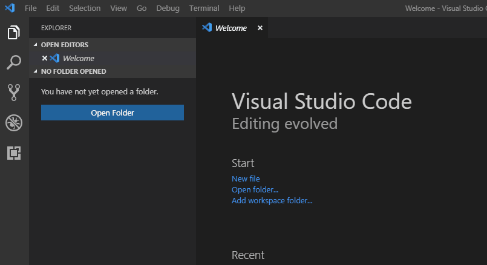

# VS Code NSIS Debug

This is a simple NSIS debugger for using NSIS. we modified the NSIS 3.01 source code to exploit the symbols used in compiling installer. it support step/breakpoint and show value of variables now.

## Run

* Clone this project;
* Install the vsix;

* Unzipped NSIS.zip;
* Clone the demo project (https://github.com/c0mpi1ors/nsis-debugger-demo.git);
* Open the demo project in vscode.

Note: If the exe file need to run as Admin, such as "RequestExecutionLevel admin" added, the VSCode need to be run as Administrator to avoid annoying UAC.

## Change Logs

### Nsis-0.2.0
* Fixed the Micro and Function issues.

### Nsis-0.1.0
* Create Nsis debugger based on Microsoft Mock Debugger project of 0.29.0.
